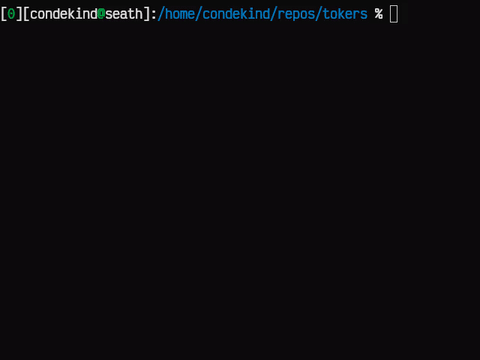

# tokers

This is a toy 'game' intended for exploration/learning of rust and external tools. Breaking changes are not a concern.

## Usage

```bash
# Clone and cd to the repo
git clone git@github.com:condekind/tokers.git && cd tokers

# Run the game
cargo run
```

__After `cargo run`, press one of the keys (`WASD`) to start__

```
controls:
     W(↑)           Q(quit)
A(←) S(↓) D(→)
```

## Sample:



## Todo:

Some of the listed items might be overkill for the time being, but this repo might also serve as a future rust template

- Learn more about modules, maybe rename world
- Move player code to another file
- Implement time steps
  - Time flows on action
  - Time flows on 1x, 2x, 3x (idling)
- DON'T implement combat!!!
  - Make it a simulation game, idk, growing mushrooms, raising undead (zombie farms), etc
- Upgrade renderer (SDL would be nice but rust won't get SDL3 bindings anytime soon)
  - Give bevy a shot? It has cute 3D foxes
  - Alt. we could render the ascii we already have in the browser with wasm
  - Might check cosmic_font if we commit to glyph based graphics (low prio)
- DON'T do 3D stuff, timesink
- UI/Menus
- Multiplayer
  - (+fun, +learn, -prob won't do it because it'll take forever)
  - Learn more about QUIC/http3? Maybe useful but distracting
- Ditch discrete coords, go f64, cast some rays
  - (+fun, +learn, -prob won't do it because it'll take forever)
- Sound
  - No, boring
